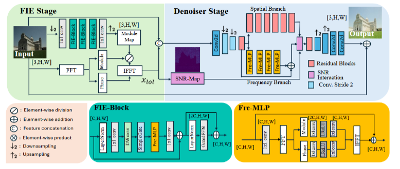

# FLOL+: Fast Baselines for Real-World Low-Light Enhancement
Juan C. Benito, Daniel Feijoo, Alvaro Garcia, Marcos V. Conde


> **Abstract:**
> Low-Light Image Enhancement (LLIE) is a key task in computational photography and imaging. The problem of enhancing images captured during night or in dark environments has been well-studied in the image signal processing literature.  However, current deep learning-based solutions struggle with efficiency and robustness in real-world scenarios (e.g. scenes with noise, saturated pixels, bad illumination). We propose a lightweight neural network that combines image processing in the frequency and spatial domains. Our method, FLOL+, is one of the fastest models for this task, achieving state-of-the-art results on popular real scenes datasets such as LOL and LSRW. Moreover, we are able to process 1080p images under 12ms. Our code and models will be open-source.

|  |  |  |
|:-------------------------:|:-------------------------:|:-------------------------:|
| Input              | UHDFour                | **FLOL+** (ours)    |
|  |  |  |
| Input                 | UHDFour    | **FLOL+** (ours)                 |

## 🛠️ **Network Architecture**



## 📦  **Dependencies and Installation**

- Python == 3.10.12
- PyTorch == 2.1.0
- CUDA == 12.1
- Other required packages in `requirements.txt`

```
# Clone this repository
git clone https://github.com/cidautai/FLOL.git
cd FLOL

# Create python environment and activate it
python3 -m venv venv_FLOL
source venv_FLOL/bin/activate

# Install python dependencies
pip install -r requirements.txt
```
## 💻 **Datasets**
The datasets used for training and/or evaluation are:

|Paired Datasets     | Sets of images | Source  |
| -----------| :---------------:|------|
|LOLv2-real        | 689 training pairs / 100 test pairs | [Google Drive](https://drive.google.com/file/d/1dzuLCk9_gE2bFF222n3-7GVUlSVHpMYC/view) |
|LOLv2-synth        | 900 training pairs / 100 test pairs | [Google Drive](https://drive.google.com/file/d/1dzuLCk9_gE2bFF222n3-7GVUlSVHpMYC/view) |
|UHD-LL          | 2000 training pairs / 150 test pairs |[UHD-LL](https://drive.google.com/drive/folders/1IneTwBsSiSSVXGoXQ9_hE1cO2d4Fd4DN)|                                                                                    |
|MIT-5k          | 5000 training pairs / 100 test pairs  |[MIT-5k](https://data.csail.mit.edu/graphics/fivek/)|  
|LSRW-Nikon | 3150 training pairs / 20 test pairs | [R2RNet](https://github.com/JianghaiSCU/R2RNet) |
|LSRW-Huawei | 2450 training pairs / 30 test pairs | [R2RNet](https://github.com/JianghaiSCU/R2RNet) |

|Unpaired Datasets     | Sets of images | Source  |
| -----------| :---------------:|------|
|BDD100k          | 100k video clips  |[BDD100k](https://dl.cv.ethz.ch/bdd100k/data/)|
|DarkFace          | 6000 images |[DarkFace](https://drive.google.com/file/d/10W3TDvEAlZfEt88hMxoEuRULr42bIV7s/view)|
|DICM | 69 images | [DICM](https://ieeexplore.ieee.org/document/6615961)|
|LIME | 10 images | [LIME](https://drive.google.com/file/d/1OvHuzPBZRBMDWV5AKI-TtIxPCYY8EW70/view)|
|MEF | 17 images | [MEF](https://ieeexplore.ieee.org/document/7120119) |
|NPE | 150 images | [NPE](https://ieeexplore.ieee.org/document/6512558) |
|VV | 24 images | [VV](https://drive.google.com/file/d/1OvHuzPBZRBMDWV5AKI-TtIxPCYY8EW70/view)|

You can download LOLv2-Real and UHD-LL datasets and put them on the `/datasets` folder for testing. 

## ✏️ **Results**
We present results in different datasets for FLOL+.

|Dataset     | PSNR| SSIM  | LPIPS|
|:-----------:|:------:|:------:|:------:|
|UHD-LL   | 25.01| 0.888| - |
|MIT-5k  | 22.10| 0.910|-|
|LOLv2-real | 21.75| 0.849|-|
|LOLv2-synth | 24.34| 0.906|-|
|LSRW-Both | 19.23| 0.583|0.273|

## ✈️ **Evaluation** 
To check our results you could run the evaluation of DarkIR in each of the datasets:
- Run ```python evaluation.py --config ./options/LOLv2-Real.yml``` on your terminal to obtain PSNR and SSIM metrics. Default is UHD-LL.

- Run ```python lpips_metric.py  -g /LSRW_GroundTruthImages_path -p /LSRW_predictedimages -e .jpg``` on your terminal to obtain LPIPS value. (LSRW predicted images are obtained by using LOLv2-Real weight file)

## 🚀 **Inference**
You can process the entire set of test images of provided datasets by running: 

- Run ```python inference.py --config ./options/LOLv2-Real.yml``` (UHD-LL is set by default)

Processed images will be saved in `./results/dataset_selected/`.

## 📷 **Gallery**

<p align="center"> <strong>  LSRW-Huawei </strong> </p>

|  |  |  |  |  |   |
|:-------------------------:|:-------------------------:|:-------------------------:|:-------------------------:|:-------------------------:|:-------------------------:|
| Input | FECNet |SNR-Net| FourLLIE | **FLOL+** (ours) | Ground Truth|

<p align="center"> <strong>  LSRW-Nikon </strong> </p>

|  |  |  |  |  |   |
|:-------------------------:|:-------------------------:|:-------------------------:|:-------------------------:|:-------------------------:|:-------------------------:|
| Input | MIRNet |RUAS| EnGAN | **FLOL+** (ours) | Ground Truth|


<p align="center"> <strong>  UHD-LL </strong> </p>

|  |  |  |  |
|:-------------------------:|:-------------------------:|:-------------------------:|:-------------------------:|
|  |  |  |  |
| Input | UHDFour | **FLOL+** (ours) | Ground Truth|

## 📢 Contact 

If you have any questions, please contact juaben@cidaut.es and marcos.conde@uni-wuerzburg.de